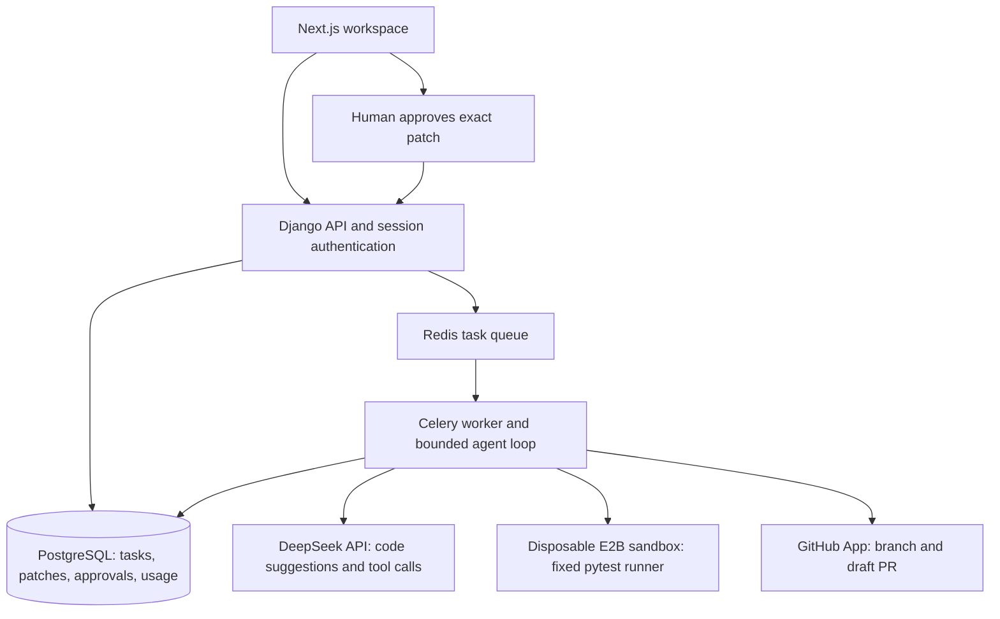

# RepoPilot

A cost-aware coding-agent workspace for small Python repositories. Inspect a plan, a code patch, verification evidence, and usage before approving a draft pull request.

## Verified demo

RepoPilot completed a small shopping-cart bug fix, ran verification, captured human approval, and published [demo draft PR #2](https://github.com/mdtnoor/repopilot-demo/pull/2) through its GitHub App.

| Evidence | Observed result |
| --- | --- |
| Bug | Cart totals ignored item quantities |
| Proposed change | Multiply each integer-cent price by quantity; existing tests already covered the requested cases |
| Baseline tests | 2 passed, 2 failed |
| Final tests reported by the sandbox | 4 passed |
| Published patch | 1 file changed; 1 addition, 1 deletion; 1 commit |
| Recorded model cost estimate | $0.00152340; E2B charges excluded |
| Approval | Bound to the exact patch and base commit |
| Sandbox cleanup | Passing and failing pytest runs both followed by E2B 404 responses for their sandbox IDs |

These observations come from the September 2026 local demo. One successful task is not an agent success-rate benchmark. The test results came from E2B, not GitHub Actions on the demo repository.

## Architecture



The model selects from a bounded tool registry. The controller applies edits, checks budgets and approval state, and controls execution and publication.

## Current status

Working prototype with a verified end-to-end demo and a deployed read-only Vercel portfolio preview. Live execution remains private and on-demand; broader reliability evaluation remains pending.

| Capability | Status |
| --- | --- |
| Next.js workspace, cobalt theme, local Geist fonts | Implemented; production build checked |
| Summary, Changes, Verification, activity, task/repository forms | Implemented |
| Illustrative coupon task | Read-only example, not a recorded agent run |
| Django session authentication, CSRF, ownership, task models | Implemented; local tests passed |
| Pydantic tool registry and bounded coding loop | Implemented; scripted provider/verifier tests passed |
| Persisted patches, final verification, exact-patch approval | Implemented; local tests passed |
| DeepSeek provider and usage/cost estimates | Verified in the local shopping-cart demo |
| E2B network-disabled verification adapter | Live verification passed; cleanup confirmed after passing and failing pytest runs |
| GitHub App draft PR publisher | Created the demo branch and draft PR after approval |
| PostgreSQL/Celery/Redis | Local integration verified; hosted deployment not verified |
| Readable API errors | Implemented; production build and mocked response checks passed |
| Windows/WSL startup launcher | Manually verified on the development machine |
| Synthetic evaluation | 10 fixtures validated against broken/reference implementations; no agent success rate claimed |
| Public multi-user arbitrary execution | Not enabled; v1 live runs/publishing require a staff operator |

No fallback returns a pretend successful patch when a live call fails. No tool can merge, force-push, or run an arbitrary shell command.

## On-demand interview demo with GitHub Codespaces

The live interview demo runs inside a GitHub Codespace while the browser accesses it through private GitHub CLI localhost forwarding. The Codespace performs the compute; the Windows machine provides the authenticated CLI connection and browser.

Inside the Codespace:

```bash
cd /workspaces/repopilot
./scripts/interview-start.sh
```

On Windows, keep this command running in its own terminal:

```powershell
gh codespace ports forward 3000:3000 8000:8000 -c YOUR_CODESPACE_NAME
```

Then open:

```text
http://127.0.0.1:3000/workspace/
```

Public `*.app.github.dev` port URLs are not required. Ports 3000 and 8000 remain private and are carried through the authenticated GitHub CLI tunnel.

After the demo:

```bash
./scripts/interview-stop.sh
```

Then press `Ctrl+C` in the Windows tunnel terminal and stop the Codespace when it is no longer needed.

## Daily startup on Windows and WSL

For an already configured installation, run from the project root in PowerShell:

```powershell
powershell -NoProfile -ExecutionPolicy Bypass -File .\scripts\start-local.ps1
```

The launcher starts PostgreSQL and Redis in Ubuntu, then opens separate terminals for Django, Celery, and the Windows frontend. It expects Windows Node/npm and a Linux virtual environment at `~/repopilot-venv`. Enter your Ubuntu sudo password if prompted. Wait for each terminal to report readiness, then open http://localhost:3000.

Stop existing development processes before launching. To shut down, press Ctrl+C in Celery and wait for it to stop, then stop Django and the frontend. PostgreSQL and Redis remain running. Starting Celery may resume queued tasks.

This launcher does not install dependencies or migrate databases. New installations should follow the setup below.

## Local setup

Prerequisites: Python 3.12, Node 22, and Redis for live background work. PostgreSQL is required for production and publishing. Local API development/tests can use SQLite.

```bash
python -m venv .venv
source .venv/bin/activate
pip install -r backend/requirements.txt
cp backend/.env.example backend/.env
python backend/manage.py migrate
python backend/manage.py createsuperuser
python backend/manage.py runserver
```

In another terminal:

```bash
cd frontend
npm ci
cp .env.example .env.local
npm run dev
```

Open `http://localhost:3000`, sign in through Settings, add a public repository, and create a draft task. Drafts do not trigger spending. Create credentials on your provider dashboards and configure the server before starting live tasks.

For the worker, after Redis is running:

```bash
cd backend
../.venv/bin/celery -A config worker --loglevel=info --concurrency=1
```

For the Windows/WSL layout used by the launcher, create the Linux environment with `python3 -m venv ~/repopilot-venv`, install `backend/requirements.txt` with that environment's pip, and run Django and Celery using its executables. Install and configure PostgreSQL and Redis inside Ubuntu; the frontend uses Windows Node/npm. Set `DATABASE_URL` before running migrations if publishing is required. Keep backend credentials in `backend/.env` and the public API URL in `frontend/.env.local`.

Windows: activate `.venv\Scripts\activate`; use WSL2 or Docker for the worker. The frontend can run normally on Windows.

## Live execution setup

1. Set `AI_API_KEY`, `E2B_API_KEY`, and `E2B_TEMPLATE` in `backend/.env` or the deployment secret manager.
2. Build an E2B template from `sandbox/Dockerfile` using the current E2B template workflow. It must contain `/usr/local/bin/python`, pytest, and a writable `/home/user`.
3. Verify that the template works with network access disabled. Add project dependencies to the trusted template before running a repository; RepoPilot does not install arbitrary repository requirements at runtime.
4. Set `LIVE_EXECUTION_ENABLED=true` on the API and worker and restart them.
5. Run one small repository task. Confirm baseline results, patch, final results, sandbox termination, and usage records before wider use.

The API model identifier is configurable. The verified local setup used `deepseek-flash`, configured for DeepSeek V4.1 Flash. Provider aliases and prices can change; check the provider documentation before selecting a model or setting cost rates. Version 1 disables thinking explicitly; it does not display or persist private reasoning.

## Execution design

The API creates a durable task and enqueues its identifier. The worker pins a GitHub commit, downloads a bounded text snapshot without extracting archive entries on the host, selects context through file/search tools, and prepares edits in a bounded in-memory working copy. **Edits are prepared in the controller; repository code is executed only in disposable E2B sandboxes.** Each test attempt gets a fresh sandbox, preventing background processes from one attempt surviving into the next.

The fixed runner invokes pytest, bounds runtime and output, and disables network access. After a successful final verification the exact diff is saved and presented for approval. A controller-checked `git_diff` observation is required after the last edit before the agent can finalize its self-review. This is self-review by the coding model, not an independent reviewer model or proof of correctness.

Tools: `inspect_repo_tree`, `search_code`, `read_file`, `set_plan`, `apply_patch`, `git_diff`, `run_tests`, `finish`.

The `apply_patch` tool performs exact unique text replacement; it is not a shell patch command. Version 1 edits Python files only, protects hidden paths/setup.py/conftest.py, supports at most 12 changed files, and has no file-deletion tool. Text snapshots and patches are stored durably; binary changes, symlinks, large repositories, arbitrary language support, and runtime dependency installation are unsupported.

## Approval and publishing

Set `GITHUB_APP_ID`, `GITHUB_APP_PRIVATE_KEY`, `GITHUB_INSTALLATION_ID`, and `PUBLISH_ENABLED=true` only after testing the read/verify workflow. Use a GitHub App installed on a repository you control, with repository Contents and Pull requests write access and Metadata read access. The private key stays on the worker/API and never enters a sandbox.

Approval is tied to the patch digest and base commit. The publisher checks the target branch still points to that commit, creates blobs/tree/commit, creates a unique branch, and opens a **draft** PR. PostgreSQL advisory locking serializes cross-worker publication. Existing branches are never force-updated. Publication retries reconcile known branch/PR state. A moved base branch requires a new task and fresh verification/approval in this version.

Public repository read access does not grant write access. Without a configured installation, download the patch. Fork-based contributions and per-user GitHub App installation onboarding are future work.

## Recovery

Browser refresh reloads persisted records; it does not drive execution. A failed task can be explicitly retried from its latest saved patch against the same base commit. The conversation restarts with that patch and fresh verification; it does not resume an interrupted model token stream or replay uncertain tools blindly.

After a worker dies, run `python backend/manage.py recover_stale_runs` after the 20-minute heartbeat threshold. It marks interrupted coding runs failed so an operator can retry. Sandboxes have a hard provider lifetime of 180 seconds. A hard crash during publication needs operator inspection of GitHub and the publication record before retrying; automatic publication crash recovery is not implemented.

## Tests and evaluation

```bash
cd backend
DJANGO_DEBUG=true ../.venv/bin/pytest -q
cd ..
.venv/bin/python scripts/check_eval_fixtures.py
npm run build
```

The 10 synthetic fixtures each fail their acceptance tests in the supplied broken version and pass in the reference version. This validates fixtures only. It does **not** measure agent performance.

For a paid live evaluation, after configuring the provider/sandbox:

```bash
python backend/manage.py evaluate_agent --username YOUR_USERNAME --limit 1 --output evaluation.json
```

Acceptance tests are withheld from the agent and applied after its run. The output measures acceptance on these synthetic tests, latency, iterations, tool calls, API cost estimate, and cost per accepted task. A broader real-repository benchmark, one-shot comparison, and context-selection ablation remain future work.

## Reusable live cleanup check

From the project root in Ubuntu:

```bash
~/repopilot-venv/bin/python scripts/check_sandbox_cleanup.py
~/repopilot-venv/bin/python scripts/check_sandbox_cleanup.py --live
```

Without `--live`, the script exits without creating sandboxes. With it, the script creates up to two billable E2B sandboxes, checks the expected passing/failing test outcomes, and confirms removal. It makes no DeepSeek calls and publishes nothing.

Exit code 0 means both checks passed; 1 means a failure or inconclusive result; 2 means live execution was not requested. Fallback cleanup does not turn a failed check into a pass. Worker crashes, forced termination, and provider/network failures are not covered by the successful live checks.

## Deployment

See [DEPLOYMENT.md](DEPLOYMENT.md) for Vercel, Render, PostgreSQL, Redis and E2B setup. `compose.yaml` supplies local API/worker/PostgreSQL/Redis services. The private Sites publication is a static, read-only product preview; it does not host Django or run code.

## Cost and trust boundaries

Cost is an **estimate at configured ceiling rates**, not a provider invoice. Input and cached-input tokens are not double-counted. Missing cache metadata is shown as unavailable. Failed requests with no usage response can have unobservable charges. Sandbox cost is separate. Repeated baseline/final verification consumes additional sandbox time.

Limits include 12 model turns, 24 tool calls, 4 test attempts, a 900-second soft task deadline, 180-second sandbox lifetimes, bounded context, and a default $0.05 API estimate cap. Next-call budget reservations use conservative byte counts and output limits. Cancellation is cooperative between operations; an in-flight model or test request may complete before cancellation takes effect.

Tests and logs originate in untrusted code and are evidence, not a security attestation. Repository tests can be weak or malicious. Use the withheld evaluation tests and human review. Redaction covers common credential formats, not every possible secret. Only public code is supported in v1.

This new codebase adapts design patterns from TriageIQ without changing that repository. It does not claim vector RAG, multi-agent routing, independent AI review, or production certification.

## Student budget and interview explanation

The student defaults target one small Python bug, not repository-wide refactoring. A limit is a ceiling, not a fixed charge or a promise of completion.

- New tasks: $0.05 estimated API limit (90% lower than the original $0.50).
- Account: $4.00 cumulative recorded API estimate, configured with `AI_ACCOUNT_BUDGET`. This leaves $1 of a $5 top-up as a planning reserve.
- Each response: at most 2,048 output tokens; 12 model turns and 24 tool calls per run.
- Verification: four sandbox attempts per run, including baseline and final; the last slot is reserved for final verification.
- Before each model call, reserve an estimated input/output allowance against both task and account limits. Recorded usage across retries counts toward both limits. There are no automatic provider retries or automatic budget increases.
- Patches already checkpointed remain available when a limit stops execution. Approval still requires passing final verification of the exact patch.

$4 / $0.05 = 80 full task-budget allocations, not 80 guaranteed successful fixes. Actual spending depends on context, output and retries. The account check is for the current user and database, not a provider-wide wallet: external API calls, other accounts/databases, deleted records, and charges from failed calls with missing usage are not covered. Keep one operator and one worker (`--concurrency=1`); the account check is not a distributed billing reservation system. Sandbox charges are separate. Check the provider dashboard before further paid testing.

Use the local scripted tests and synthetic fixture checks during development; they make no paid model calls. Save paid runs for small, reproducible bugs and final demos. Do not claim a live success rate until measured.

To update an existing local installation, run `python backend/manage.py migrate` and restart the API and worker. The migration changes defaults for new tasks; existing tasks retain their recorded limits. Create a fresh task to use the student defaults. Add `AI_ACCOUNT_BUDGET=4.00` to your backend environment (it also defaults to 4.00 when omitted). Keep your existing credentials and database.

Recruiter explanation: “I designed RepoPilot to operate within a student budget. It checks an estimated token allowance before each model call, enforces a five-cent task limit and a cumulative account limit, and bounds both tool calls and verification attempts. It persists patches and usage so a budget stop is inspectable. Reducing cost does not bypass final tests or human approval. These controls are implemented and tested locally; the verified shopping-cart demo recorded $0.00152340 in estimated model usage, excluding sandbox charges. Broader cost and reliability measurements remain pending.”

## Development history

See [PROGRESS.md](PROGRESS.md) for the checklist and the [merged pull requests](https://github.com/thanos07/repopilot/pulls?q=is%3Apr+is%3Amerged) for incremental changes, reviews, and CI results.

## Security configuration

See [SECURITY.md](SECURITY.md) for vulnerability reporting and supported scope.
See [security configuration](docs/security-configuration.md) for HTTPS settings, repository scanning, and private operator deployment guidance.
