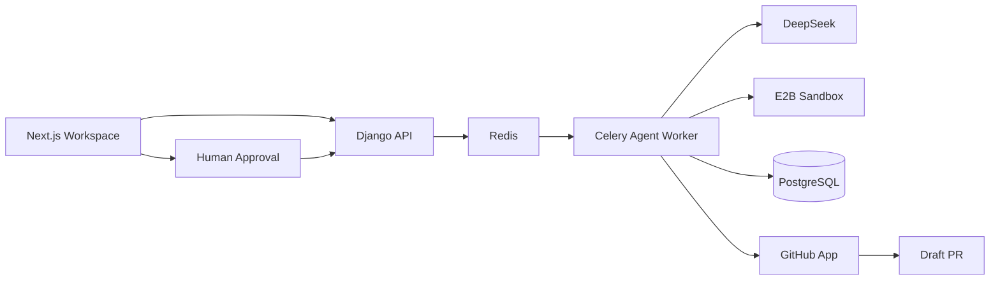

<p align="center">
  <picture>
    <source media="(prefers-color-scheme: dark)" srcset="frontend/public/brand/repopilot-logo-dark.svg">
    <source media="(prefers-color-scheme: light)" srcset="frontend/public/brand/repopilot-logo.svg">
    
  </picture>
</p>

<p align="center">
  <strong>AI-assisted code changes with isolated verification and human-controlled GitHub publishing.</strong>
</p>

<p align="center">
  <a href="https://repopilot-cyan.vercel.app">Live Preview</a> ·
  <a href="https://github.com/mdtnoor/repopilot-demo/pull/2">Verified Demo PR</a> ·
  <a href="DEPLOYMENT.md">Deployment</a> ·
  <a href="SECURITY.md">Security</a>
</p>

---

## Overview

RepoPilot is an AI coding workspace for small Python repositories.

It combines repository analysis, planning, patch generation, isolated verification, persisted task state, human approval, and draft pull-request publishing in one controlled workflow.

The public Vercel deployment is a **read-only product preview**. Live execution remains private and operator-controlled.

## How it works



### Workflow components

**Next.js Workspace**  
Provides the interface for repositories, tasks, plans, patches, verification results, activity, and approvals.  
It communicates with the backend API and displays persisted execution state.

**Django API**  
Handles authentication, repositories, tasks, approvals, configuration checks, and API responses.  
It creates durable task records and coordinates the frontend, database, queue, and publishing workflow.

**Redis**  
Provides the queue used to move long-running coding tasks from the API to background workers.  
This keeps execution asynchronous and separates web requests from agent processing.

**Celery Agent Worker**  
Runs the bounded coding workflow in the background.  
It coordinates repository inspection, model interaction, patch preparation, verification, persistence, and publishing state.

**DeepSeek**  
Provides the language-model capability for code analysis, planning, tool selection, and patch generation.  
The model operates through a restricted tool interface instead of unrestricted system access.

**E2B Sandbox**  
Runs repository tests inside disposable isolated environments.  
Verification happens separately from the application host, with network access disabled during repository code execution.

**PostgreSQL**  
Stores repositories, tasks, runs, patches, verification results, approvals, usage records, and publication state.  
Persisted data allows task state to survive browser refreshes and worker restarts.

**Human Approval**  
Keeps publishing under explicit user control.  
Approval is tied to the exact patch and base commit so an altered or stale change cannot reuse an earlier approval.

**GitHub App**  
Provides controlled repository write access after verification and approval.  
It creates the commit, branch, and draft pull request without exposing GitHub credentials to the model or sandbox.

**Draft Pull Request**  
Represents the final publishing stage of the workflow.  
RepoPilot creates a reviewable draft PR rather than automatically merging changes or force-updating branches.

## Verified end-to-end workflow

RepoPilot has completed a full controlled execution against a demo repository:

- repository state was loaded from a pinned commit
- baseline verification identified failing tests
- the agent produced a bounded source-code change
- the updated code passed final isolated verification
- the exact patch was reviewed and approved
- the GitHub App published the result as a real draft pull request

**Demo:** [mdtnoor/repopilot-demo#2](https://github.com/mdtnoor/repopilot-demo/pull/2)

This demonstrates the implemented workflow and is not presented as a general performance benchmark.

## Tech stack

| Area | Technology |
| --- | --- |
| Frontend | Next.js 16, React 19, TypeScript |
| Backend | Django 5, Django REST Framework |
| AI | DeepSeek via OpenAI-compatible Python SDK |
| Background jobs | Celery + Redis |
| Database | PostgreSQL |
| Sandbox | E2B |
| GitHub integration | GitHub App |
| Platform | Docker, GitHub Codespaces, Vercel |
| CI / Security | GitHub Actions, CodeQL, Dependabot |

## Safety and control

RepoPilot is designed with explicit execution boundaries.

- Repository code executes only inside disposable E2B sandboxes.
- Network access is disabled during verification.
- The agent uses a bounded tool registry and limited execution loop.
- No arbitrary shell tool is exposed directly to the model.
- Final verification is required before approval.
- Approval is tied to the exact patch and base commit.
- GitHub credentials remain outside the model and sandbox.
- RepoPilot creates draft pull requests instead of automatically merging changes.
- Existing branches are not force-pushed.

Version 1 focuses on controlled code changes for small Python repositories rather than unrestricted autonomous software development.

## Run with GitHub Codespaces

Inside the Codespace:

```bash
./scripts/interview-start.sh
```

The startup script:

- verifies the required configuration
- builds the current API and worker images
- starts PostgreSQL, Redis, Django, and Celery
- applies database migrations
- builds and starts the frontend
- verifies API and frontend health

From the local machine, forward the private Codespaces ports:

```powershell
gh codespace ports forward 3000:3000 8000:8000 -c YOUR_CODESPACE_NAME
```

Open:

```text
http://127.0.0.1:3000/workspace/
```

Stop the environment with:

```bash
./scripts/interview-stop.sh
```

## Project status

RepoPilot currently includes:

- repository and task management
- bounded AI coding workflow
- persisted plans and patches
- isolated test execution
- final verification evidence
- explicit human approval
- GitHub App draft-PR publishing
- background task processing
- PostgreSQL persistence
- automated CI and security scanning
- read-only public product preview
- protected main branch workflow

Public signup and unrestricted multi-user code execution are intentionally not enabled.

## Documentation

- [Deployment guide](DEPLOYMENT.md)
- [Security policy](SECURITY.md)
- [Security configuration](docs/security-configuration.md)
- [Development history](PROGRESS.md)

## License

RepoPilot is available under the [MIT License](LICENSE).

---

<p align="center">
  Built as an exploration of reliable, controlled AI-assisted software engineering.
</p>
